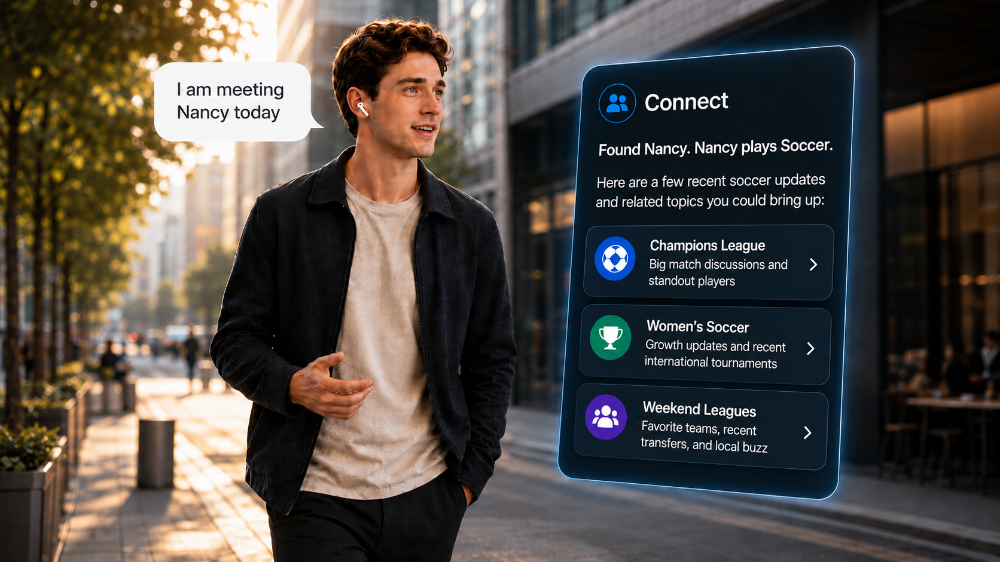
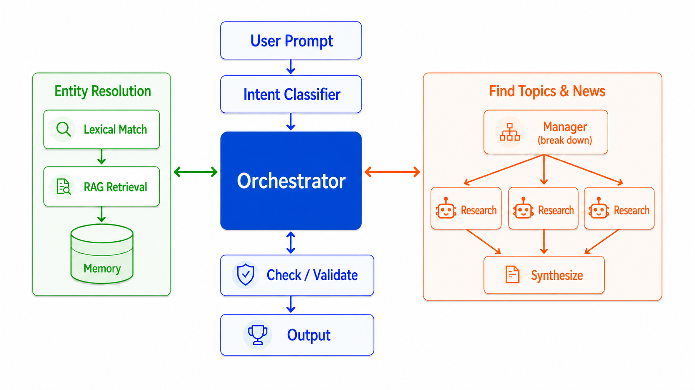

# Connect (2026 Velocity Cornerstone Project)

> Tell Connect who you're about to meet. It identifies the right person from your saved context, finds relevant updates around their interests, and turns everything into a short, mobile-friendly conversation brief.

  

---

## How it works

  

Connect is built around one main idea: **an agentic shell around a deterministic core**.

LLMs are used where judgment helps: understanding the user prompt, asking clarifying questions, and producing natural conversation suggestions. Deterministic code handles the parts that need to stay reliable: resolving people, running research workflows, enforcing brevity, validating sources, and gating memory updates.

That keeps the product flexible at the edges while making the core system easier to test, control, and trust.

---

## Core flow

### 1. Intent Classifier

A single lightweight LLM call classifies the user prompt into one of three paths:

- `prep` — preparing for a conversation, like *"I'm meeting Alex tomorrow"*
- `recall` — asking about someone already in saved context, like *"who was that person from Velocity?"*
- `update` — adding a new fact, like *"Alex just started at Shopify"*

When the input is unclear, Connect defaults to `prep`, because that is the main product path and usually degrades gracefully.

### 2. Orchestrator

The orchestrator is a **bounded agent**. It interprets the request, decides which tools to call, asks clarifying questions when needed, and answers follow-ups. It drives the lifecycle:

**resolve → clarify if needed → plan → research → synthesize → validate → return**

The agent has freedom over *what to do and what to say*, but the determinism lives one layer down, in the tools it calls — entity resolution, the research workflow, synthesis, and memory writes. Each tool returns validated output, and dangerous actions like memory writes sit behind user confirmation. So the agent can flex to any prompt, but it cannot blow the brevity budget, fabricate sources, or silently change saved context.

This is the deliberate middle of the spectrum: more flexible than a fixed script, but bounded by turn limits, validated tools, and confirmation gates. The trade-off is that the *tools* must be built and guarded up front, rather than letting the model improvise the risky work itself.

### 3. Entity Resolution: the “who”

Before generating topics, Connect first resolves who the user means. It uses a hybrid approach:

- **Lexical and phonetic matching** for names and typos, so *"Alxe"* can still match *"Alex"*
- **RAG over saved context** for vague references, like *"the person who was nervous about grad school"*
- A structured memory store with `Person`, `Interaction`, and `PrepSession` records

The resolver can return `resolved`, `ambiguous`, `clarify`, or `not_found`. If multiple people match, Connect asks the user to choose instead of guessing.

The key design choice: **names are not treated as vector-search problems**. Identity works better with lexical and phonetic matching; embeddings are more useful for fuzzy content and memory recall when low confidence.

### 4. Find Topics & News: the “what to say”

After identifying the person, Connect highlights what matters: memory cues, recent context, and conversation sparks:

1. **Manager** agent breaks the situation into a few useful subjects.
2. **Research ×N** runs those subjects concurrently.
3. **Synthesize** agent curates the best results into a phone-sized card.

Each research branch is a deterministic workflow:

**Brave search → pick URLs → scrape pages → synthesize with citations**

Research is not an open-ended agent, so runaway tool loops are structurally avoided. The trade-off is that it is less flexible than a free agent, but much easier to bound, debug, and validate.

### 5. Check / Validate → Output

Before returning, Connect validates the final card against hard constraints:

- valid schema
- real source URLs
- line and length budget
- phone-friendly formatting

---

## Design trade-offs

| Decision | Choice | Why |
|---|---|---|
| Top-level control | Bounded agent over deterministic tools | Flexible for any prompt, but invariants live in the tools, not the model |
| Identity retrieval | Lexical + phonetic matching | Better for names, typos, and duplicate people |
| Memory recall | RAG over saved context | Better for fuzzy references and past interactions |
| Research | Deterministic workflow | Avoids runaway loops and uncontrolled tool use |
| Concurrency | Parallel per-subject research | Faster multi-topic prep, bounded by search API limits |
| Output | Strict brevity budget | Keeps the result useful on a phone |
| Model access | OpenRouter gateway | Easy model swapping through environment variables |

---

## Security

The core rule is simple: external content can help shape the conversation brief, but **it should not be able to control the app, call tools, change memory, or leak information**. Connect enforces this through **architectural isolation**, with prompt-level defenses and validation as supporting layers.

Connect keeps that boundary clear in a few ways:

* **Input screening** — the Intent Classifier can reject empty, abusive, off-topic, or obviously unsafe prompts before the main flow starts.
* **Bounded research** — scraped pages are read by components that return structured findings, not tool actions.
* **Confirmed memory writes** — Connect does not silently change saved context.
* **Output validation** — Check / Validate enforces schema, source, length, and formatting rules, then uses an LLM judge to review the final card for safety before it reaches the user.

---

## Status

Active prototype. The Intent Classifier, Entity Resolution, and Find Topics & News are being iterated in the `backend/` notebooks. The unified orchestrator, and validation gate are in progress.

